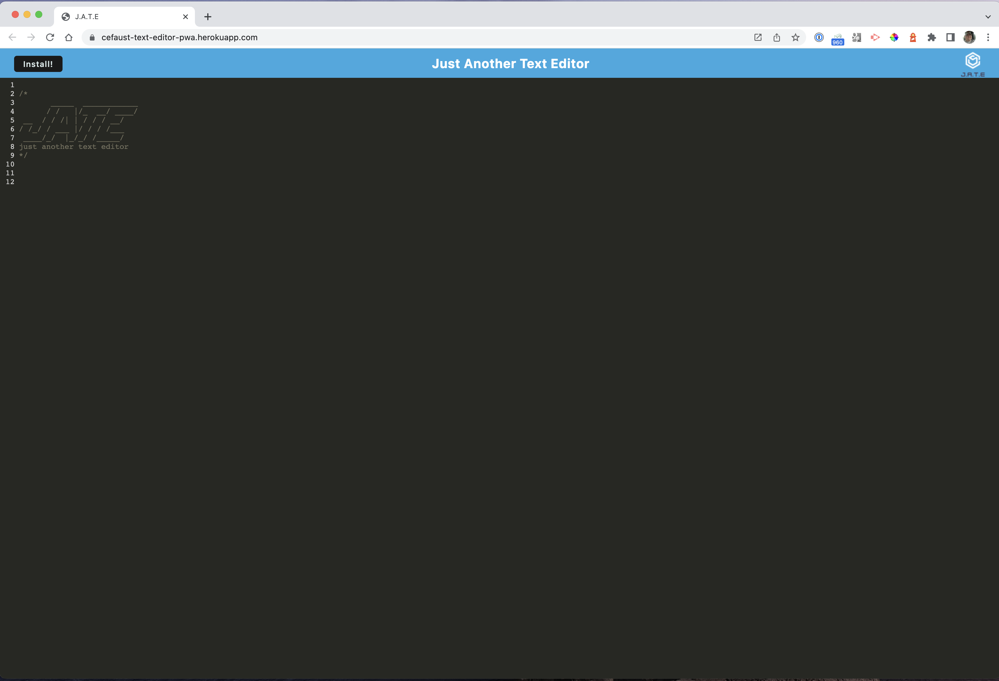

# text-editor-pwa

## Description
With this project I was tasked with creating a text editor Progressive Web Application(PWA) that a user could take notes 
or code snippets with or without an internet connection.  This would allow the user to retrieve the notes for later use.

## Things I included in this project
1. When the user opens the application in their chosen editor. They should see a client server folder structure.
2. When the user runs `npm run start` from the root directory. They will find that the application will start up the 
back end and serve the client.
3. When the user runs the text editor application from the terminal.  They will find that the JavaScript files have been
bundled with webpack.
4. When the webpack plugins run.  The user will find that there is a generated HTML file, service worker, and a manifest 
file.
5. If the user uses next-gen Javascript in the application. They will find that the text editor still works in the 
browser with no errors.
6. When the user opens the text editor. They find that IndexedDB has immediately created a database storage.
7. When the user enters content to the text editor and click off the DOM window.  Then the user will find that the 
content of the text editor has been saved with IndexedDB.
8. If the user clicks on the Install button.  Then the web application will be downloaded as an icon on the desktop.
9. When the user loads the web application.  Then there should be a registered service worker using workbox.
10. When the user registers a service worker. Then they should expect static assets pre cached upon loading along with
subsequent pages and static assets.
11. When the user deploys this application to Heroku.  The user should have proper scripts for a webpack application.

## [working text editor on heroku](https://cefaust-text-editor-pwa.herokuapp.com/)

